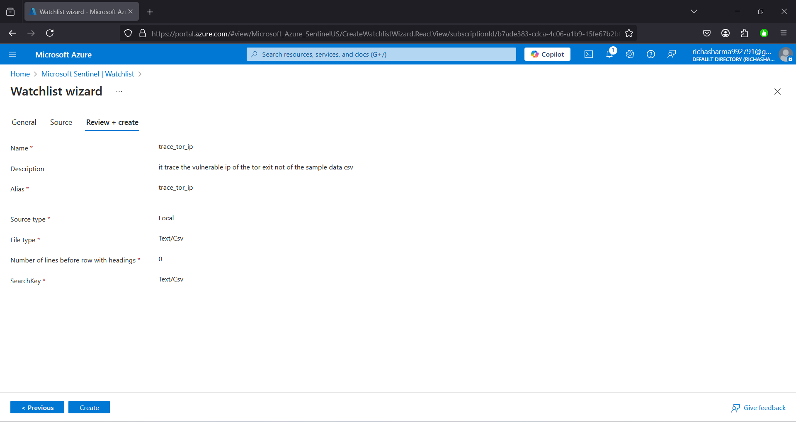
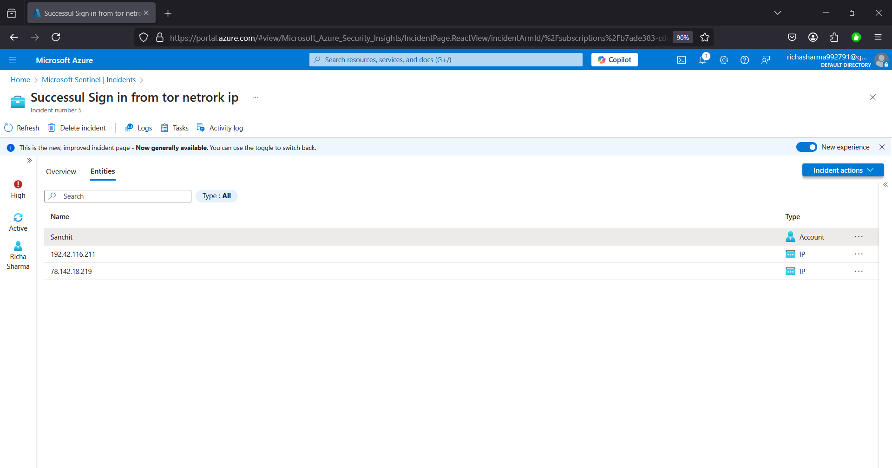
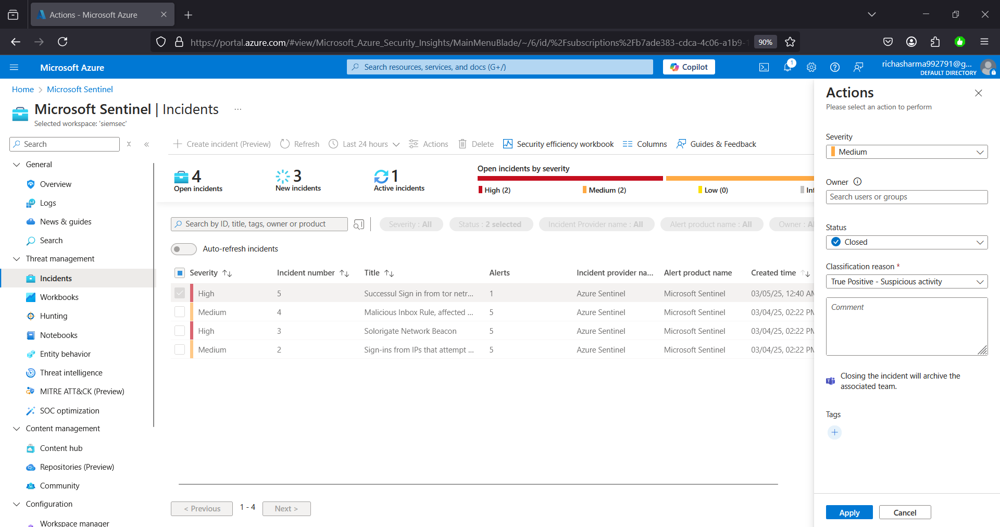

# Project Overview: Enhancing Security Monitoring with Microsoft Sentinel

This project showcases the implementation of Microsoft Sentinel to bolster security monitoring and incident response capabilities. The primary objectives include:

- Setting up Microsoft Sentinel and configuring essential prerequisites.
- Ingesting and analyzing security logs, such as security alerts, Log Analytics queries, and security incidents.
- Creating a watchlist for Tor exit nodes and developing an analytics rule to detect successful sign-ins from the Tor network.
- Simulating a threat scenario by creating a user account and analyzing the incident generated.
- Demonstrating proficiency in incident response, investigation, threat identification, assessment, remediation, and documentation.

## Prerequisites and Initial Setup

1. **Deploy Microsoft Sentinel All-In-One Template:**

   Begin by deploying the Microsoft Sentinel All-In-One template from GitHub into your Azure environment. This template provides a comprehensive setup of Sentinel with pre-configured settings, streamlining the deployment process.
https://github.com/javiersoriano/sentinel-all-in-one

2. **Configure Log Analytics Workspace:**

   After deployment, ensure that the Log Analytics workspace, named "siemsec," is properly configured. This involves setting up diagnostic settings to route logs and telemetry data into Microsoft Sentinel for analysis.

   *Reference: [Best practices for Microsoft Sentinel](https://learn.microsoft.com/en-us/azure/sentinel/best-practices)*

3. **Verify Log Ingestion:**

   Confirm that logs such as security alerts, Log Analytics query logs, and security incidents are being ingested into Microsoft Sentinel. This verification ensures that Sentinel has the necessary data to monitor and analyze security events effectively.

## Creating a Watchlist for Tor Exit Nodes
1. **Prepare the Tor Exit Nodes CSV File:**

   Obtain a list of current Tor exit nodes and save it as a CSV file on your local machine. This list will serve as the basis for the watchlist in Microsoft Sentinel.

2. **Import the Watchlist into Microsoft Sentinel:**

   - Navigate to the Microsoft Sentinel workspace.
   - Under the "Configuration" section, select "Watchlist."
   - Click on "Add new" to create a new watchlist.
   - Provide a name (e.g., "trace_tor_ip") and a description for the watchlist.
   - In the source section, upload the previously prepared Tor exit nodes CSV file.
   - Complete the process to create the watchlist.

   *Reference: [Create watchlists in Microsoft Sentinel](https://learn.microsoft.com/en-us/azure/sentinel/watchlists-create)*

## Developing an Analytics Rule for Tor Network Sign-Ins

1. **Create a Scheduled Analytics Rule:**

   - In Microsoft Sentinel, navigate to the "Analytics" section.
   - Click on "Create" and select "Scheduled query rule."
   - Provide a name for the rule, such as "Successful Sign-In from Tor Network," and include a description outlining its purpose.

2. **Define the Rule Logic:**

   Construct a Kusto Query Language (KQL) query that identifies successful sign-in attempts originating from IP addresses listed in the "trace_tor_ip" watchlist.
.png)

3. **Configure Entity Mapping:**

   Map relevant entities to enrich the alerts generated by the rule:

   - **Account:** SID, username, display name, and user principal name.
   - **IP Address:** Source IP address associated with the sign-in attempt.

4. **Set the Query Schedule:**

   - Configure the rule to run every 5 minutes to ensure timely detection of suspicious sign-ins.
   - Enable alert grouping to consolidate related alerts into a single incident for streamlined investigation.

5. **Activate the Analytics Rule:**

   Finalize the creation of the analytics rule and ensure it is enabled to start monitoring for successful sign-ins from the Tor network.

## Simulating a Threat Scenario

1. **Create a Threat User Account:**

   - In Azure Active Directory (AD), create a new user account with the username "sanchit" and assign a secure password.
   - Assign the "Security Reader" role to this user to grant necessary permissions.

   *Reference: [Assign Azure AD roles to users](https://learn.microsoft.com/en-us/azure/active-directory/roles/manage-roles)*

2. **Assign Privileged Roles:**

   - Navigate to the "Access control (IAM)" section in Azure.
   - Add role assignments for the "Privileged Administrator" and "Contributor" roles to the "sanchit" user.

   *Reference: [Azure built-in roles](https://learn.microsoft.com/en-us/azure/role-based-access-control/built-in-roles)*

3. **Simulate a Sign-In from the Tor Network:**

   - Using the Brave browser configured with Tor, log in to the Azure portal using the "sanchit" account.
   - This action simulates a sign-in attempt from the Tor network, which should trigger the previously configured analytics rule it also delete the diagnostic settings to stop logs generation.

   *Reference: [Tor Browser](https://www.torproject.org/download/)*

## Incident Investigation and Response

1. **Detect the Incident:**

   - Upon the simulated sign-in, Microsoft Sentinel generates an incident titled "Successful Sign-In from Tor Network."
   - As a security analyst, access the Microsoft Sentinel portal to review and investigate the incident.

   *Reference: [Investigate incidents with Microsoft Sentinel](https://learn.microsoft.com/en-us/azure/sentinel/investigate-incidents)*

2. **Assign and Investigate the Incident:**

   - Assign the incident to yourself for investigation.
   - Review the incident details, including associated alerts, entities, and related events.
   - Examine the IP address involved in the sign-in attempt and cross-reference it with external threat intelligence sources, such as AbuseIPDB, to assess its reputation.

   *Reference: [AbuseIPDB](https://www.abuseipdb.com/)*

3. **Analyze User Entity Behavior:**

   - Navigate to the "Entity behavior" section in Microsoft Sentinel to review the activities associated with the "sanchit" user account.
   - Assess any anomalies or patterns that could indicate malicious intent.

4. **Remediate the Threat:**

   - Based on the investigation, determine that the "sanchit" account poses a security risk.
   - Navigate to Azure AD and disable the "sanchit" user account to prevent further unauthorized access and disable the user.

   *Reference: [Block a user in Azure AD](https://learn.microsoft.com/en-us/azure/active-directory/user-help/user-help-block-user-account)*

5. **Reconfigure Diagnostic Settings:**

   - Ensure that diagnostic settings for the Log Analytics workspace and Microsoft Sentinel are correctly configured to continue monitoring and logging activities.

   *Reference: [Configure diagnostic settings for Azure resources](https://learn.microsoft.com/en-us/azure/azure-monitor/essentials/diagnostic-settings)*

6. **Close the Incident:**

   - Document the investigation findings, actions taken, and any recommendations for future prevention.
   - Close the incident in Microsoft Sentinel, providing a detailed description of the remediation steps executed.

   *Reference: [Manage incidents in Microsoft Sentinel](https://learn.microsoft.com/en-us/azure/sentinel/incidents)*

## Conclusion

This project demonstrates the effective use of Microsoft Sentinel for security monitoring, threat detection, incident investigation, and response. Key aspects highlighted include:

- Configuring watchlists and analytics rules to detect suspicious activities, such as sign-ins from the Tor network.
- Simulating threat scenarios to validate detection and response mechanisms.
- Conducting thorough incident investigations, leveraging entity behavior analysis, and utilizing external threat intelligence sources.
- Implementing prompt remediation actions to mitigate identified threats and documenting the incident response process comprehensively.

By following these practices, organizations can enhance their security posture and ensure a robust incident response strategy.
